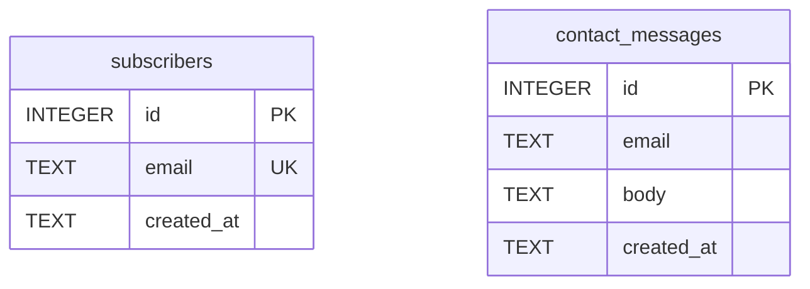

# Phase 5：功能模块与数据设计

Phase 4 的设计方向（artifacts/phase-4/direction.md）确认后、动手写代码前，读本文件执行 Phase 5。

## 阶段目标

把"设计方向"翻译成"工程合同"：模块清单、数据设计、接口契约、技术栈选择。
这套产物是 Phase 6 的**固定开发输入**——Phase 6 只照着实现，不再做设计决策。
所以原则是**宁可少而准**：每多一个模块/表/接口，Phase 6 就多一份实现与测试成本；拿不准的砍成 P1 或直接不写。

**先看平台再看数据形态**：数据设计的产物形态由平台决定（读 `.productflow/wizard.json` 的 `primary`，`PC`/`H5`/`APP` 大写，缺失则从 brief.json/产品定位推断）。

- **Web 项目（primary = PC / H5）**：走完整 ER 图 → DDL → API 契约流程，产出 modules.md / er.md / schema.sql / api.md / template-choice.md 五份。
- **iOS App 项目（primary = APP）**：纯本地持久化、无后端——数据层产物是 SwiftData `@Model`（不是 ER 图/DDL/SQL），schema-ddl 与 api-contract 两步标 skipped；ER 思考仍可保留作为推导中间物，但**封板产物是 `@Model`**。详见 templates.md 的 P-iOS 小节。

下面各 Step 中凡涉及 DDL/API 的，都按此分叉；选栈细节以 templates.md 为准。

阶段开始时执行：

```bash
python3 "$SKILL_DIR/scripts/pf_state.py" phase 5 --status active
python3 "$SKILL_DIR/scripts/pf_state.py" log "Phase 5 启动：基于 direction.md 做功能与数据设计"
```

## Step 1: module-list — 功能模块清单

从 artifacts/phase-4/direction.md 推导模块，写 `artifacts/phase-5/modules.md`。
推导逻辑：先列页面上每个区块/交互（hero、表单、统计……），再问"它需要后端吗？需要存数据吗？"——只有答"是"的才成为功能模块，纯静态展示不算模块。

落地页常见模块参考清单（按 direction.md 取舍，不要全抄）：

| 模块 | 典型优先级 | 说明 |
|------|-----------|------|
| waitlist / 订阅表单 | P0 | 落地页核心转化动作，邮箱收集 + 去重 |
| 联系我们 | P1 | 留言落库，无需即时通知 |
| 内容区块管理 | P1 | 标题/文案/FAQ 可由数据驱动，仅当需要不改代码更新内容时才做 |
| 访问统计 | P1 | 轻量 page view 计数，不要做成完整 analytics |
| admin 登录 | 可选 | 仅当上面有模块需要后台管理界面时才引入 |

modules.md 每个模块写：名称、P0/P1、一句话职责、涉及的数据实体。P0 = 没有它产品不成立；P1 = 首版可砍。
有歧义（如"订阅"是收邮箱还是付费订阅）时，先在 CLI 问用户，不要默默选一个。

```bash
python3 "$SKILL_DIR/scripts/pf_state.py" step 5 module-list --status done
python3 "$SKILL_DIR/scripts/pf_state.py" artifact 5 artifacts/phase-5/modules.md --title "功能模块清单"
```

## Step 2: er-diagram — 实体关系设计

用 database-schema-designer skill 的方法论设计实体：从 modules.md 的数据实体出发，定字段、主键、外键、唯一约束、索引。落地页规模通常 3–6 张表，超过 8 张说明范围失控，回头砍模块。

> **iOS App（primary = APP）也做这一步**：实体/字段/关系的思考对 SwiftData `@Model` 同样适用——把它当推导中间物。下一步（schema-ddl）才分叉：Web 落成 SQL DDL，iOS 落成 `@Model`。

设计要点（为什么）：
- 邮箱类字段加 UNIQUE——去重在数据库层做，比应用层可靠
- 查询路径决定索引：会按 created_at 排序展示就建索引，不会查的字段不建
- 不为想象中的扩展预留字段（如多租户 tenant_id），首版用不到就不加

ER 图用 mermaid `erDiagram` 语法写进 `artifacts/phase-5/er.md`（操作台和 GitHub 都能直接渲染 mermaid，无需出图片）。示例骨架：

````markdown

````

er.md 中在图下方补一段文字：每张表一句话职责 + 关键约束的理由。

```bash
python3 "$SKILL_DIR/scripts/pf_state.py" step 5 er-diagram --status done
python3 "$SKILL_DIR/scripts/pf_state.py" artifact 5 artifacts/phase-5/er.md --title "ER 图"
```

## Step 3: schema-ddl — 数据层（Web → DDL / iOS → @Model）

数据层产物按平台分叉。

### Web 项目（primary = PC / H5）→ SQLite DDL

把 ER 图落成 `artifacts/phase-5/schema.sql`，**SQLite 方言**——Web 预设里 T2/T3 都用 SQLite 系（Cloudflare D1 和单机 SQLite），统一方言后 Phase 7 无论部署到哪都不用改 schema。

SQLite/D1 兼容写法约定：
- 主键用 `INTEGER PRIMARY KEY`（即 rowid 别名），不写 AUTOINCREMENT（D1 兼容且更快）
- 布尔用 `INTEGER` 0/1；时间用 `TEXT` 存 ISO8601，配 `DEFAULT (datetime('now'))`
- 每条 `CREATE TABLE` / `CREATE INDEX` 加 `IF NOT EXISTS`，让脚本可重复执行
- 不用 PRAGMA、触发器、ATTACH 等 D1 不保证支持的特性

示例片段（按 er.md 推导，不要照抄）：

```sql
CREATE TABLE IF NOT EXISTS subscribers (
  id         INTEGER PRIMARY KEY,
  email      TEXT NOT NULL UNIQUE,
  created_at TEXT NOT NULL DEFAULT (datetime('now'))
);
CREATE INDEX IF NOT EXISTS idx_subscribers_created ON subscribers(created_at);
```

写完跑一次验证（verification-before-completion）：

```bash
sqlite3 /tmp/pf_schema_check.db < .productflow/artifacts/phase-5/schema.sql && rm /tmp/pf_schema_check.db
```

Web 项目登记产物并标完成：

```bash
python3 "$SKILL_DIR/scripts/pf_state.py" step 5 schema-ddl --status done
python3 "$SKILL_DIR/scripts/pf_state.py" artifact 5 artifacts/phase-5/schema.sql --title "数据库 DDL (SQLite)"
```

### iOS App 项目（primary = APP）→ SwiftData @Model

纯本地 App 没有 SQL 层——**不出 DDL**，改为从 Step 2 同一批实体推导 SwiftData `@Model` 类，写进 `artifacts/phase-5/models.swift`：

- 每个实体一个 `@Model class`，字段映射成 Swift 属性；关系用 `@Relationship`。
- 唯一性约束不靠 SQL `UNIQUE`，而在写入逻辑里保证——ModelContext 写入前先按键查重（如邮箱/标题已存在则不插），把这条规则在 models.swift 里注释清楚。
- 不为想象中的扩展加属性（同 Web 的"不预留字段"原则）。

iOS 项目 schema-ddl step 标 **skipped**（逐字执行），并登记 `@Model` 产物：

```bash
python3 "$SKILL_DIR/scripts/pf_state.py" step 5 schema-ddl --status skipped
python3 "$SKILL_DIR/scripts/pf_state.py" artifact 5 artifacts/phase-5/models.swift --title "SwiftData @Model 数据层"
```

## Step 4: api-contract — API 契约

> **iOS App（primary = APP，纯本地持久化）跳过本步**：无网络后端就无 HTTP 契约，api-contract step 标 skipped。若产品需要本地服务抽象（导出、通知调度等），用 `Services/` 下的 Swift `protocol` 定义边界、写进 artifacts/phase-5/，不是 HTTP 端点。
> ```bash
> python3 "$SKILL_DIR/scripts/pf_state.py" step 5 api-contract --status skipped
> ```
> 下面是 Web 项目（primary = PC / H5）的流程。

写 `artifacts/phase-5/api.md`。只为 modules.md 中的 P0/P1 模块定义接口，每个模块通常 1–3 个端点。
这份契约是 Phase 6 前后端并行开发与 api-docs 步骤的共同依据，所以请求/响应要写到字段级。

表格格式（逐列）：

| Method | Path | 请求 | 响应 | 错误码 |
|--------|------|------|------|--------|
| POST | /api/subscribe | `{"email": "a@b.com"}` | `201 {"id": 1}` | 400 邮箱格式错；409 已存在 |
| POST | /api/contact | `{"email","body"}` | `201 {"id"}` | 400 字段缺失 |
| GET | /api/stats | - | `200 {"views": 123}` | - |

约定：路径统一 `/api/` 前缀；错误响应统一 `{"error": "message"}` 结构；错误码只列业务上会发生的（不为不可能的情况编错误码）。

```bash
python3 "$SKILL_DIR/scripts/pf_state.py" step 5 api-contract --status done
python3 "$SKILL_DIR/scripts/pf_state.py" artifact 5 artifacts/phase-5/api.md --title "API 契约"
```

## Step 5: pick-template — 选栈（先打包资料再分析，pick-stack）

读 templates.md。本步**第一动作不是套预设，而是先打包该产品的可分析上下文，基于资料分析判断最合适的产品形态与技术栈**，再决定命中预设还是另选栈：

1. **打包可分析上下文**（先做）：平台（wizard.json 的 `primary`，缺则从 brief/产品定位推断）+ brief.json（产品定位 / 目标用户 / 核心需求）+ replicate-notes（信息架构）+ direction.md（设计方向）+ 本阶段已产出的功能/数据需求清单（modules.md / er.md / api.md）。
2. **基于这份资料分析判断**最合适的形态与栈——不机械套预设。
3. 用户需求多样：除现有预设（P-iOS 原生 iOS / T1·T2·T3 Web），还可能是 Android、桌面应用（Electron / Tauri / 原生）、浏览器扩展、CLI 工具、小程序、混合形态等。**预设是常见情况的起点/参考，不是穷举、更不是锁死**——不在预设里的需求按分析结果选/适配合适的栈，别硬塞进最接近的预设。
4. 命中常见情况时，用下面的决策树**快速定档**（它接在"打包→分析"之后、是捷径不是边界）：**根节点先看平台**，再在平台分支内选具体预设。这些预设是减少选择成本的好默认，不是唯一选项——产品确实需要就换栈/换库，在 template-choice.md 写明理由即可（栈能力与目录树细节、完整"打包→分析"框定以 templates.md 为准）：

```
平台（primary）？
├─ APP（原生移动）→ 原生 App 栈
│   ├─ iOS → P-iOS（SwiftUI + SwiftData，本期实现）
│   └─ Android → 本期标 TODO（向用户说明暂只交付 iOS，或确认改做 H5）
└─ PC / H5（Web）→ Web 预设，按数据需求选：
    ├─ 需要 admin 后台 / 登录 / 自有服务器？
    │   └─ 是 → T3 landing-fullstack
    └─ 否 → 需要持久化数据（waitlist / 订阅 / 计数 / 留言）？
        ├─ 是 → T2 landing-worker（D1 即 SQLite 方言，schema.sql 直接用）
        └─ 否 → T1 static-landing（纯静态：er-diagram、schema-ddl 标 skipped；api-contract 视有无表单端点，详见 templates.md T1）
```

为什么 Phase 5 就定栈：Phase 6 的 scaffold 步骤直接从所选预设起步，现在不定，前面的数据层/接口设计可能与运行时不匹配（比如选了 T1 却设计了一堆接口，或 APP 项目却出了 SQLite DDL）。

把以下内容写进 `artifacts/phase-5/template-choice.md`：**打包了哪些资料 → 分析依据 → 选了什么 / 为什么**（平台、命中预设则走了哪条分支、若另选栈/换库写明为什么默认预设不满足这个产品）。
若选型影响成本或方向（Web 部署目标的域名/服务器；APP 的 Android 取舍、要联网后端、要复杂云同步），在 CLI 向用户确认后再定稿。

step id 仍是 `pick-template`（脚本注册名不变），逐字执行：

```bash
python3 "$SKILL_DIR/scripts/pf_state.py" step 5 pick-template --status done
python3 "$SKILL_DIR/scripts/pf_state.py" artifact 5 artifacts/phase-5/template-choice.md --title "技术栈选择与理由"
```

## 检查点

阶段收尾按固定顺序执行：

1. 读网页端消息并逐条回应（用户可能在操作台对模块清单提了意见，先消化再封板）：

   ```bash
   python3 "$SKILL_DIR/scripts/pf_state.py" inbox
   python3 "$SKILL_DIR/scripts/pf_state.py" reply "<对该条留言的回应>"   # 每条留言各回一次
   ```

   有消息影响设计的，改产物、重新 artifact 登记后再继续。

2. 确认产物齐全且互相一致，按平台分别核对：
   - **Web（PC / H5）**：modules.md ↔ er.md ↔ schema.sql ↔ api.md ↔ template-choice.md 五份；T1 时 er-diagram、schema-ddl 标 skipped，api-contract 视有无表单端点（无端点则也 skipped），口径以 templates.md 的 T1 节为准。
   - **iOS（APP）**：modules.md ↔ er.md ↔ models.swift ↔ template-choice.md；`@Model` 覆盖 er.md 里每个实体与关系，schema-ddl / api-contract 两步已标 skipped。

3. 标记阶段完成：

   ```bash
   python3 "$SKILL_DIR/scripts/pf_state.py" phase 5 --status done
   python3 "$SKILL_DIR/scripts/pf_state.py" log "Phase 5 完成：平台 <PC/H5/APP>，N 个模块 / 数据层(M 张表 或 M 个 @Model) / K 个接口(iOS 无)，选定预设 <T1/T2/T3/P-iOS>"
   ```

4. 在 CLI 向用户汇报：模块清单（P0/P1）、数据层规模（表数 / `@Model` 数）、接口数量（iOS 项目说明无网络后端）、平台与所选预设及理由，并明确说"这套设计将作为 Phase 6 的固定开发输入，确认后开始实现"。请用户在网页或 CLI 确认后进入 Phase 6；用户此前明确说过"全自动"则不停留。

下一阶段见 phase-6-implement.md。
