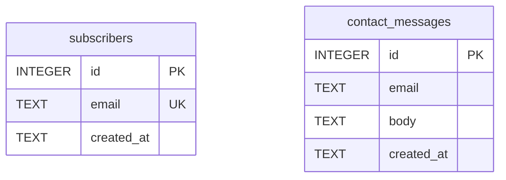

# Phase 5：功能模块与数据设计

Phase 4 的设计方向（artifacts/phase-4/direction.md）确认后、动手写代码前，读本文件执行 Phase 5。

## 阶段目标

把"设计方向"翻译成"工程合同"：模块清单、ER 图、DDL、API 契约、模板选择，共 5 份产物。
这 5 份产物是 Phase 6 的**固定开发模板输入**——Phase 6 只照着实现，不再做设计决策。
所以原则是**宁可少而准**：每多一个模块/表/接口，Phase 6 就多一份实现与测试成本；拿不准的砍成 P1 或直接不写。

阶段开始时执行：

```bash
python3 "$SKILL_DIR/scripts/pf_state.py" phase 5 --status active
python3 "$SKILL_DIR/scripts/pf_state.py" log "Phase 5 启动：基于 direction.md 做功能与数据设计"
```

## Step 1: module-list — 功能模块清单

从 artifacts/phase-4/direction.md 推导模块，写 `artifacts/phase-5/modules.md`。
推导逻辑：先列页面上每个区块/交互（hero、表单、统计……），再问"它需要后端吗？需要存数据吗？"——只有答"是"的才成为功能模块，纯静态展示不算模块。

落地页常见模块参考清单（按 direction.md 取舍，不要全抄）：

| 模块 | 典型优先级 | 说明 |
|------|-----------|------|
| waitlist / 订阅表单 | P0 | 落地页核心转化动作，邮箱收集 + 去重 |
| 联系我们 | P1 | 留言落库，无需即时通知 |
| 内容区块管理 | P1 | 标题/文案/FAQ 可由数据驱动，仅当需要不改代码更新内容时才做 |
| 访问统计 | P1 | 轻量 page view 计数，不要做成完整 analytics |
| admin 登录 | 可选 | 仅当上面有模块需要后台管理界面时才引入 |

modules.md 每个模块写：名称、P0/P1、一句话职责、涉及的数据实体。P0 = 没有它产品不成立；P1 = 首版可砍。
有歧义（如"订阅"是收邮箱还是付费订阅）时，先在 CLI 问用户，不要默默选一个。

```bash
python3 "$SKILL_DIR/scripts/pf_state.py" step 5 module-list --status done
python3 "$SKILL_DIR/scripts/pf_state.py" artifact 5 artifacts/phase-5/modules.md --title "功能模块清单"
```

## Step 2: er-diagram — 实体关系设计

用 database-schema-designer skill 的方法论设计实体：从 modules.md 的数据实体出发，定字段、主键、外键、唯一约束、索引。落地页规模通常 3–6 张表，超过 8 张说明范围失控，回头砍模块。

设计要点（为什么）：
- 邮箱类字段加 UNIQUE——去重在数据库层做，比应用层可靠
- 查询路径决定索引：会按 created_at 排序展示就建索引，不会查的字段不建
- 不为想象中的扩展预留字段（如多租户 tenant_id），首版用不到就不加

ER 图用 mermaid `erDiagram` 语法写进 `artifacts/phase-5/er.md`（操作台和 GitHub 都能直接渲染 mermaid，无需出图片）。示例骨架：

````markdown

````

er.md 中在图下方补一段文字：每张表一句话职责 + 关键约束的理由。

```bash
python3 "$SKILL_DIR/scripts/pf_state.py" step 5 er-diagram --status done
python3 "$SKILL_DIR/scripts/pf_state.py" artifact 5 artifacts/phase-5/er.md --title "ER 图"
```

## Step 3: schema-ddl — DDL

把 ER 图落成 `artifacts/phase-5/schema.sql`，**SQLite 方言**——三个模板里两个用 SQLite 系（Cloudflare D1 和单机 SQLite），统一方言后 Phase 7 无论部署到哪都不用改 schema。

SQLite/D1 兼容写法约定：
- 主键用 `INTEGER PRIMARY KEY`（即 rowid 别名），不写 AUTOINCREMENT（D1 兼容且更快）
- 布尔用 `INTEGER` 0/1；时间用 `TEXT` 存 ISO8601，配 `DEFAULT (datetime('now'))`
- 每条 `CREATE TABLE` / `CREATE INDEX` 加 `IF NOT EXISTS`，让脚本可重复执行
- 不用 PRAGMA、触发器、ATTACH 等 D1 不保证支持的特性

示例片段（按 er.md 推导，不要照抄）：

```sql
CREATE TABLE IF NOT EXISTS subscribers (
  id         INTEGER PRIMARY KEY,
  email      TEXT NOT NULL UNIQUE,
  created_at TEXT NOT NULL DEFAULT (datetime('now'))
);
CREATE INDEX IF NOT EXISTS idx_subscribers_created ON subscribers(created_at);
```

写完跑一次验证（verification-before-completion）：

```bash
sqlite3 /tmp/pf_schema_check.db < .productflow/artifacts/phase-5/schema.sql && rm /tmp/pf_schema_check.db
```

```bash
python3 "$SKILL_DIR/scripts/pf_state.py" step 5 schema-ddl --status done
python3 "$SKILL_DIR/scripts/pf_state.py" artifact 5 artifacts/phase-5/schema.sql --title "数据库 DDL (SQLite)"
```

## Step 4: api-contract — API 契约

写 `artifacts/phase-5/api.md`。只为 modules.md 中的 P0/P1 模块定义接口，每个模块通常 1–3 个端点。
这份契约是 Phase 6 前后端并行开发与 api-docs 步骤的共同依据，所以请求/响应要写到字段级。

表格格式（逐列）：

| Method | Path | 请求 | 响应 | 错误码 |
|--------|------|------|------|--------|
| POST | /api/subscribe | `{"email": "a@b.com"}` | `201 {"id": 1}` | 400 邮箱格式错；409 已存在 |
| POST | /api/contact | `{"email","body"}` | `201 {"id"}` | 400 字段缺失 |
| GET | /api/stats | - | `200 {"views": 123}` | - |

约定：路径统一 `/api/` 前缀；错误响应统一 `{"error": "message"}` 结构；错误码只列业务上会发生的（不为不可能的情况编错误码）。

```bash
python3 "$SKILL_DIR/scripts/pf_state.py" step 5 api-contract --status done
python3 "$SKILL_DIR/scripts/pf_state.py" artifact 5 artifacts/phase-5/api.md --title "API 契约"
```

## Step 5: pick-template — 选开发模板

读 templates.md，按三问决策树选 T1/T2/T3（模板能力细节以 templates.md 为准）：

```
Q1 需要后端吗？（modules.md 里有任何写库模块吗）
 ├─ 否 → T1（纯静态，schema.sql/api.md 可为空——回头把对应 step 标 skipped）
 └─ 是 → Q2 需要 admin 后台吗？
      ├─ 否 → Q3 部署目标？（问用户或看 Phase 1 记录）
      │    ├─ Cloudflare Pages/Workers → T2（D1 即 SQLite 方言，schema.sql 直接用）
      │    └─ 单机/自有服务器 → T3
      └─ 是 → T3（admin 需要会话与服务端渲染，单机模板承载）
```

为什么 Phase 5 就定模板：Phase 6 的 scaffold 步骤直接从模板起步，现在不定，前面的 DDL/API 设计可能与运行时不匹配（比如选了 T1 却设计了一堆接口）。

把选择结果 + 三问的回答 + 一句话理由写进 `artifacts/phase-5/template-choice.md`。
若 Q3 答案影响成本（如域名、服务器），在 CLI 向用户确认后再定稿。

```bash
python3 "$SKILL_DIR/scripts/pf_state.py" step 5 pick-template --status done
python3 "$SKILL_DIR/scripts/pf_state.py" artifact 5 artifacts/phase-5/template-choice.md --title "模板选择与理由"
```

## 检查点

阶段收尾按固定顺序执行：

1. 读网页端消息并逐条回应（用户可能在操作台对模块清单提了意见，先消化再封板）：

   ```bash
   python3 "$SKILL_DIR/scripts/pf_state.py" inbox
   python3 "$SKILL_DIR/scripts/pf_state.py" reply "<对该条留言的回应>"   # 每条留言各回一次
   ```

   有消息影响设计的，改产物、重新 artifact 登记后再继续。

2. 确认 5 份产物齐全且互相一致（modules.md ↔ er.md ↔ schema.sql ↔ api.md ↔ template-choice.md；T1 时允许 schema/api 为空但需 step 标 skipped）。

3. 标记阶段完成：

   ```bash
   python3 "$SKILL_DIR/scripts/pf_state.py" phase 5 --status done
   python3 "$SKILL_DIR/scripts/pf_state.py" log "Phase 5 完成：N 个模块 / M 张表 / K 个接口，选定模板 Tx"
   ```

4. 在 CLI 向用户汇报：模块清单（P0/P1）、表数量、接口数量、所选模板及理由，并明确说"这套设计将作为 Phase 6 的固定开发输入，确认后开始实现"。请用户在网页或 CLI 确认后进入 Phase 6；用户此前明确说过"全自动"则不停留。

下一阶段见 phase-6-implement.md。
