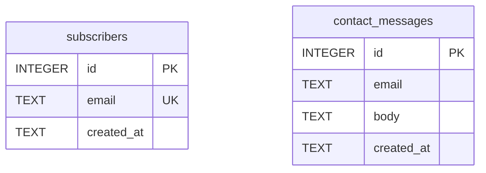

# Phase 5：功能模块与数据设计

Phase 4 的设计方向（artifacts/phase-4/direction.md）确认后、动手写代码前，读本文件执行 Phase 5。

## 阶段目标

把"设计方向"翻译成"工程合同"：模块清单、数据设计、接口契约、技术栈选择。
这套产物是 Phase 6 的**固定开发输入**——Phase 6 只照着实现，不再做设计决策。
所以原则是**宁可少而准**：每多一个模块/表/接口，Phase 6 就多一份实现与测试成本；拿不准的砍成 P1 或直接不写。

**先看平台再看数据形态**：数据设计的产物形态由平台决定（读 `.productflow/wizard.json` 的 `primary`，`PC`/`H5`/`APP` 大写，缺失则从 brief.json/产品定位推断）。

- **Web 项目（primary = PC / H5）**：走完整 ER 图 → DDL → API 契约流程，产出 modules.md / er.md / schema.sql / api.md / template-choice.md 五份。
- **iOS App 项目（primary = APP，预设 P-iOS）**：纯本地持久化、无后端——数据层产物是 SwiftData `@Model`（不是 ER 图/DDL/SQL），schema-ddl 与 api-contract 两步标 skipped；ER 思考仍可保留作为推导中间物，但**封板产物是 `@Model`**。详见 templates.md 的 P-iOS 小节。
- **Android App 项目（primary = APP，预设 P-Android）**：纯本地持久化、无后端——数据层产物是 Room `@Entity`/`@Dao` 类（不是 ER 图/DDL/SQL），schema-ddl 与 api-contract 两步标 skipped；ER 思考仍可保留作为推导中间物，但**封板产物是 Room `@Entity`/`@Dao`**。详见 templates.md 的 P-Android 小节。
- **PC 桌面应用项目（primary = PC，预设 P-Desktop）**：数据层 = 嵌入式 SQLite——**出 `schema.sql` DDL（和 Web 同口径，schema-ddl 步骤正常产出，NOT skipped）**；Tauri 用 `tauri-plugin-sql`/rusqlite 运行这套 DDL，Electron 用 better-sqlite3。纯本地桌面应用无 HTTP 后端，api-contract 标 skipped；若带云后端则按 Web 出 API 契约。注意：P-Desktop 是原生预设中的例外——它**出 DDL**（和 iOS/Android 的"不出 DDL"相反），数据层口径与 Web 相同。详见 templates.md 的 P-Desktop 小节。

下面各 Step 中凡涉及 DDL/API 的，都按此分叉；选栈细节以 templates.md 为准。

阶段开始时执行：

```bash
python3 "$SKILL_DIR/scripts/pf_state.py" phase 5 --status active
python3 "$SKILL_DIR/scripts/pf_state.py" log "Phase 5 启动：基于 direction.md 做功能与数据设计"
```

## Step 1: module-list — 功能模块清单

从 artifacts/phase-4/direction.md 推导模块，写 `artifacts/phase-5/modules.md`。
推导逻辑：先列页面上每个区块/交互（hero、表单、统计……），再问"它需要后端吗？需要存数据吗？"——只有答"是"的才成为功能模块，纯静态展示不算模块。

落地页常见模块参考清单（按 direction.md 取舍，不要全抄）：

| 模块 | 典型优先级 | 说明 |
|------|-----------|------|
| waitlist / 订阅表单 | P0 | 落地页核心转化动作，邮箱收集 + 去重 |
| 联系我们 | P1 | 留言落库，无需即时通知 |
| 内容区块管理 | P1 | 标题/文案/FAQ 可由数据驱动，仅当需要不改代码更新内容时才做 |
| 访问统计 | P1 | 轻量 page view 计数，不要做成完整 analytics |
| admin 登录 | 可选 | 仅当上面有模块需要后台管理界面时才引入 |

modules.md 每个模块写：名称、P0/P1、一句话职责、涉及的数据实体。P0 = 没有它产品不成立；P1 = 首版可砍。
有歧义（如"订阅"是收邮箱还是付费订阅）时，先在 CLI 问用户，不要默默选一个。

```bash
python3 "$SKILL_DIR/scripts/pf_state.py" step 5 module-list --status done
python3 "$SKILL_DIR/scripts/pf_state.py" artifact 5 artifacts/phase-5/modules.md --title "功能模块清单"
```

## Step 2: er-diagram — 实体关系设计

用 database-schema-designer skill 的方法论设计实体：从 modules.md 的数据实体出发，定字段、主键、外键、唯一约束、索引。落地页规模通常 3–6 张表，超过 8 张说明范围失控，回头砍模块。

> **原生 App（iOS/Android，primary = APP）也做这一步**：实体/字段/关系的思考对 SwiftData `@Model`（P-iOS）和 Room `@Entity`（P-Android）同样适用——把它当推导中间物。下一步（schema-ddl）才分叉：Web 落成 SQL DDL，iOS 落成 `@Model`，Android 落成 Room `@Entity`/`@Dao`。**PC 桌面应用（P-Desktop）同样做这一步**，且和 Web 完全一样——ER 图直接推导 SQL DDL，不分叉，schema-ddl 步骤正常产出 `schema.sql`。

设计要点（为什么）：
- 邮箱类字段加 UNIQUE——去重在数据库层做，比应用层可靠
- 查询路径决定索引：会按 created_at 排序展示就建索引，不会查的字段不建
- 不为想象中的扩展预留字段（如多租户 tenant_id），首版用不到就不加

ER 图用 mermaid `erDiagram` 语法写进 `artifacts/phase-5/er.md`（操作台和 GitHub 都能直接渲染 mermaid，无需出图片）。示例骨架：

````markdown

````

er.md 中在图下方补一段文字：每张表一句话职责 + 关键约束的理由。

```bash
python3 "$SKILL_DIR/scripts/pf_state.py" step 5 er-diagram --status done
python3 "$SKILL_DIR/scripts/pf_state.py" artifact 5 artifacts/phase-5/er.md --title "ER 图"
```

## 数据态 + UI 数据边界 → design-spec（还原度方案专题 D · R-⑤a/b）

数据模型定完，顺带定「数据驱动的 UI 边界」——④ 已定组件的**交互态**，⑤ 补**数据态**，一起进 design-spec 的 `pages[].states`，供 ⑥ 用真实边界数据渲染 + 验收。不定这些，⑥ 只会用理想假数据撑出跟设计稿不同的布局。

对承载数据的关键页/组件，补数据态与边界：
- **空数据**：列表/表格/仪表盘为空时的空态（`empty`）。
- **多数据/溢出**：典型条数 vs 最大条数（决定要不要虚拟滚动/分页，`overflow`）。
- **长文本截断**：长标题/长正文的省略号 vs 换行规则。
- **加载**：数据在途的 `loading`/skeleton。

写进 design-spec（承接 ④ 的交互态，追加数据态）：

```bash
# 数据容器类组件补数据态（与 ④ 的交互态合并存入 states）
python3 "$SKILL_DIR/scripts/pf_state.py" spec set-page <pg-id> --state "list:default,empty,loading,overflow"
# 长文本/条数边界写进该页 note 或 modules.md，⑥ 用真实边界数据渲染（别用「3 条完美假数据」撑布局）
```

> iOS/Android/Desktop 同理：Room / SwiftData / SQLite 的实体条数与字段长度就是 UI 数据边界，一并交代给 ⑥。

## 产品流程图 + 业务逻辑状态图（REQ-1 · 两张 mermaid 产物）

REQ-1 的四张图里，**数据关系 / 数据模型**已由 ER 图（上一步）+ schema 覆盖；这里补另外两张，同样用 **mermaid 写成 `.md` 产物**（操作台产物弹窗直接渲染 mermaid，和 ER 图一样，无需另出图片）：

1. **产品流程图** `artifacts/phase-5/product-flow.md`——用户主流程 / 关键路径（mermaid `flowchart`）：从入口到核心转化的页面 / 步骤流转（结合 ④ 页面地图 + 模块）。
2. **业务逻辑状态图** `artifacts/phase-5/state-diagram.md`——关键实体 / 流程的状态机（mermaid `stateDiagram-v2`）：如订单 待支付 → 已支付 → 已发货 → 完成 / 取消。**只画有明确状态流转的实体**，没有就跳过并说明。

```bash
python3 "$SKILL_DIR/scripts/pf_state.py" artifact 5 artifacts/phase-5/product-flow.md --title "产品流程图"
python3 "$SKILL_DIR/scripts/pf_state.py" artifact 5 artifacts/phase-5/state-diagram.md --title "业务逻辑状态图"
```

（这两张是理解性设计图，与**系统流程图**[页面 → 接口 → 数据]互补：系统流程图讲"调用 / 数据链路"，这两张讲"用户流程"与"状态流转"。纯静态 / 简单产品可只画产品流程图、状态图按需。）

## 选型前置门 — schema-ddl 前先定型 + 用户参与（涉后端 + DB + 栈）

> **顺序要点（用户参与的关键点）**：Step 3 schema-ddl（数据层方言 / 是否 skip）、Step 4 api-contract（有无接口）、⑥ 系统流程图 **都依赖「涉不涉后端 + 什么 DB + 什么栈」**——所以选型决策要在**写 schema-ddl 之前**做掉，并**让用户（技术负责人）参与确认**，不能拖到本阶段最后。`pick-template` 的 step id 虽登记在最后（脚本注册名不变），但它的**调研 / 决策 / DB 选型流程（见 Step 5）要在这里就执行**；最后在 pick-template 步把最终选择写进 `template-choice.md`。

1. **判涉后端（DEC-5）**：据 Step 1 的 module-list——有需要存数据 / 服务端的功能模块 = 涉后端（Web 走 T2/T3）；纯静态展示、无数据模块 = 无后端（Web = T1，schema-ddl / api-contract 后续标 skipped）。原生本地（iOS / Android / 纯本地桌面）= 无 HTTP 后端、但有本地数据层。
   - **判为无后端时**（含原生本地）：后续 ⑦ 后端实现阶段会在操作台**整体隐藏、跳过**；测试**不并入 ⑥**（⑥ 只做前端 + 视觉还原），而是在 **⑧ 测试阶段做前端集成 / E2E / 回归**——⑧ 对无后端项目照常有 integration-test / e2e-test / regression / test-report 步骤，无需给 ⑥ 额外补测试步。
2. **涉后端才选 DB + 定后端栈**：按 Step 5 的「实时联网调研选型 + 数据库选型」流程执行——agent 按场景实时调研 + 推荐，再用 `choice ask` 让用户确认（全自动模式直接用默认）。**先把 DB 方言定下来，再写 Step 3 的 DDL。**
3. 定完再进 Step 3：schema-ddl 按选定平台 / DB 出数据层；无后端（T1）则 er-diagram / schema-ddl / api-contract 相应标 skipped。

## Step 3: schema-ddl — 数据层（Web → DDL / iOS → SwiftData @Model / Android → Room @Entity / PC 桌面应用 → SQLite DDL（同 Web））

数据层产物按平台分叉。

### Web 项目（primary = PC / H5）→ SQLite DDL

把 ER 图落成 `artifacts/phase-5/schema.sql`，**SQLite 方言**——Web 预设里 T2/T3 都用 SQLite 系（Cloudflare D1 和单机 SQLite），统一方言后 Phase 7 无论部署到哪都不用改 schema。

SQLite/D1 兼容写法约定：
- 主键用 `INTEGER PRIMARY KEY`（即 rowid 别名），不写 AUTOINCREMENT（D1 兼容且更快）
- 布尔用 `INTEGER` 0/1；时间用 `TEXT` 存 ISO8601，配 `DEFAULT (datetime('now'))`
- 每条 `CREATE TABLE` / `CREATE INDEX` 加 `IF NOT EXISTS`，让脚本可重复执行
- 不用 PRAGMA、触发器、ATTACH 等 D1 不保证支持的特性

示例片段（按 er.md 推导，不要照抄）：

```sql
CREATE TABLE IF NOT EXISTS subscribers (
  id         INTEGER PRIMARY KEY,
  email      TEXT NOT NULL UNIQUE,
  created_at TEXT NOT NULL DEFAULT (datetime('now'))
);
CREATE INDEX IF NOT EXISTS idx_subscribers_created ON subscribers(created_at);
```

写完跑一次验证（verification-before-completion）：

```bash
sqlite3 /tmp/pf_schema_check.db < .productflow/artifacts/phase-5/schema.sql && rm /tmp/pf_schema_check.db
```

Web 项目登记产物并标完成：

```bash
python3 "$SKILL_DIR/scripts/pf_state.py" step 5 schema-ddl --status done
python3 "$SKILL_DIR/scripts/pf_state.py" artifact 5 artifacts/phase-5/schema.sql --title "数据库 DDL (SQLite)"
```

### iOS App 项目（primary = APP）→ SwiftData @Model

纯本地 App 没有 SQL 层——**不出 DDL**，改为从 Step 2 同一批实体推导 SwiftData `@Model` 类，写进 `artifacts/phase-5/models.swift`：

- 每个实体一个 `@Model class`，字段映射成 Swift 属性；关系用 `@Relationship`。
- 唯一性约束不靠 SQL `UNIQUE`，而在写入逻辑里保证——ModelContext 写入前先按键查重（如邮箱/标题已存在则不插），把这条规则在 models.swift 里注释清楚。
- 不为想象中的扩展加属性（同 Web 的"不预留字段"原则）。

iOS 项目 schema-ddl step 标 **skipped**（逐字执行），并登记 `@Model` 产物：

```bash
python3 "$SKILL_DIR/scripts/pf_state.py" step 5 schema-ddl --status skipped
python3 "$SKILL_DIR/scripts/pf_state.py" artifact 5 artifacts/phase-5/models.swift --title "SwiftData @Model 数据层"
```

### Android App 项目（primary = APP）→ Room @Entity

纯本地 App 没有 SQL 层——**不出 DDL**，改为从 Step 2 同一批实体推导 Room `@Entity`/`@Dao` 类，写进 `artifacts/phase-5/entities.kt`：

- 每个实体一个 `@Entity data class`，字段映射成 Kotlin 属性；关系通过 `@Embedded` 或 `@Relation` 处理，或用外键引用。
- 为每个实体定义对应的 `@Dao` 接口，声明 CRUD 操作；整体用 `@Database` 汇聚，写在同一文件末尾。
- 唯一性约束用 `@Entity(indices = [Index(value = ["email"], unique = true)])` 等注解在数据库层声明——不依赖应用层查重。
- Room 基于注解在编译时生成 SQLite schema，**无需手写 DDL**；把这条规则在 entities.kt 里注释清楚。
- 不为想象中的扩展加字段（同 Web 的"不预留字段"原则）。

Android 项目 schema-ddl step 标 **skipped**（逐字执行），并登记 Room 产物：

```bash
python3 "$SKILL_DIR/scripts/pf_state.py" step 5 schema-ddl --status skipped
python3 "$SKILL_DIR/scripts/pf_state.py" artifact 5 artifacts/phase-5/entities.kt --title "Room @Entity/@Dao 数据层"
```

### PC 桌面应用项目（primary = PC，P-Desktop）→ SQLite DDL（同 Web）

P-Desktop 是原生预设中数据层口径与 Web 相同的**唯一例外**——数据层用嵌入式 SQLite，**schema-ddl 步骤正常产出 `artifacts/phase-5/schema.sql`，不标 skipped**。按 Web 项目同样的 SQLite DDL 约定写即可（见上方 Web 小节）；Tauri 用 `tauri-plugin-sql`/rusqlite 在运行时执行这套 DDL，Electron 用 better-sqlite3。

> 区别于 iOS（`@Model`，schema-ddl skipped）和 Android（Room `@Entity`，schema-ddl skipped）——P-Desktop 出 DDL，**不出** ORM 注解产物。

写完同样跑验证：

```bash
sqlite3 /tmp/pf_schema_check.db < .productflow/artifacts/phase-5/schema.sql && rm /tmp/pf_schema_check.db
```

P-Desktop 项目登记产物并标完成：

```bash
python3 "$SKILL_DIR/scripts/pf_state.py" step 5 schema-ddl --status done
python3 "$SKILL_DIR/scripts/pf_state.py" artifact 5 artifacts/phase-5/schema.sql --title "数据库 DDL (SQLite, 嵌入式)"
```

## Step 4: api-contract — API 契约

> **原生 App（primary = APP，纯本地持久化）跳过本步**：无网络后端就无 HTTP 契约，api-contract step 标 skipped。
> - **iOS（P-iOS）**：若需要本地服务抽象（导出、通知调度等），用 `Services/` 下的 Swift `protocol` 定义边界、写进 artifacts/phase-5/，不是 HTTP 端点。
> - **Android（P-Android）**：若需要本地服务抽象，用 Kotlin `interface` 定义边界、写进 artifacts/phase-5/，不是 HTTP 端点。
> - **PC 桌面应用（P-Desktop）纯本地**：嵌入式 SQLite、无 HTTP 后端——api-contract step 同样标 skipped。若 P-Desktop 项目带云后端，则按 Web 流程出 API 契约、标 done。
> ```bash
> python3 "$SKILL_DIR/scripts/pf_state.py" step 5 api-contract --status skipped
> ```
> 下面是 Web 项目（primary = PC / H5）的流程。

写 `artifacts/phase-5/api.md`。只为 modules.md 中的 P0/P1 模块定义接口，每个模块通常 1–3 个端点。
这份契约是 Phase 6 前后端并行开发与 api-docs 步骤的共同依据，所以请求/响应要写到字段级。

表格格式（逐列）：

| Method | Path | 请求 | 响应 | 错误码 |
|--------|------|------|------|--------|
| POST | /api/subscribe | `{"email": "a@b.com"}` | `201 {"id": 1}` | 400 邮箱格式错；409 已存在 |
| POST | /api/contact | `{"email","body"}` | `201 {"id"}` | 400 字段缺失 |
| GET | /api/stats | - | `200 {"views": 123}` | - |

约定：路径统一 `/api/` 前缀；错误响应统一 `{"error": "message"}` 结构；错误码只列业务上会发生的（不为不可能的情况编错误码）。

```bash
python3 "$SKILL_DIR/scripts/pf_state.py" step 5 api-contract --status done
python3 "$SKILL_DIR/scripts/pf_state.py" artifact 5 artifacts/phase-5/api.md --title "API 契约"
```

## Step 5: pick-template — 选栈（先打包资料再分析，pick-stack）

读 templates.md。本步**第一动作不是套预设，而是先打包该产品的可分析上下文，基于资料分析判断最合适的产品形态与技术栈**，再决定命中预设还是另选栈：

1. **打包可分析上下文**（先做）：平台（wizard.json 的 `primary`，缺则从 brief/产品定位推断）+ brief.json（产品定位 / 目标用户 / 核心需求）+ replicate-notes（信息架构）+ direction.md（设计方向）+ 本阶段已产出的功能/数据需求清单（modules.md / er.md / api.md）。
2. **基于这份资料分析判断**最合适的形态与栈——不机械套预设。
3. 用户需求多样：除现有预设（P-iOS 原生 iOS / P-Android 原生 Android / T1·T2·T3 Web），还可能是桌面应用（Electron / Tauri / 原生）、浏览器扩展、CLI 工具、小程序、混合形态等。**预设是常见情况的起点/参考，不是穷举、更不是锁死**——不在预设里的需求按分析结果选/适配合适的栈，别硬塞进最接近的预设。
4. 命中常见情况时，用下面的决策树**快速定档**（它接在"打包→分析"之后、是捷径不是边界）：**根节点先看平台**，再在平台分支内选具体预设。这些预设是减少选择成本的好默认，不是唯一选项——产品确实需要就换栈/换库，在 template-choice.md 写明理由即可（栈能力与目录树细节、完整"打包→分析"框定以 templates.md 为准）：

```
平台（primary）？
├─ APP（原生移动）→ 原生 App 栈
│   ├─ iOS → P-iOS（SwiftUI + SwiftData，本期实现）
│   └─ Android → P-Android（Kotlin + Jetpack Compose + Room，本期实现）
├─ PC（桌面）→ 先确认形态：
│   ├─ 桌面 Web 站点（跑在浏览器里）→ 走 Web 预设（见下方 PC / H5 分支）
│   └─ 桌面应用（安装到本机）→ P-Desktop（Tauri，本期实现；备选 Electron）
│       数据层 = 嵌入式 SQLite，出 schema.sql（schema-ddl NOT skipped）
│       api-contract：纯本地 → skipped；带云后端 → 出 API 契约
└─ PC / H5（Web）→ Web 预设，按数据需求选：
    ├─ 需要 admin 后台 / 登录 / 自有服务器？
    │   └─ 是 → T3 landing-fullstack
    └─ 否 → 需要持久化数据（waitlist / 订阅 / 计数 / 留言）？
        ├─ 是 → T2 landing-worker（D1 即 SQLite 方言，schema.sql 直接用）
        └─ 否 → T1 static-landing（纯静态：er-diagram、schema-ddl 标 skipped；api-contract 视有无表单端点，详见 templates.md T1）
```

**实时联网调研选型（REQ-6 · DEC-4，通用型优先）**：上面的预设/决策树是**默认起点、不是终点**——定稿前**用 WebSearch 实时联网调研**：按本产品的**场景**（产品类型 + 平台 + 规模/并发/团队）查当前**主流、维护活跃、通用性强**的框架/库与推荐默认参数，而不是凭记忆或死套固定预设。调研三点：① 该场景当前主流推荐的框架/技术栈（版本、维护状态、生态活跃度）；② 关键库的当前稳定版本 + 推荐默认配置参数；③ 有更通用/更省心的选择就采纳。在 `template-choice.md` 写明「预设默认 → 实时调研结论 → 最终选择 + 出处链接」。**降级**：拿不到联网/WebSearch 时退回预设默认，并 `log` 说明「未联网、用预设默认」——不硬报错。

**数据库选型（REQ-9 · 仅当涉及后端）**：DEC-5 判定**涉及后端**（T2/T3、带云后端的桌面等）才做；纯静态 T1 / 原生本地（SwiftData / Room / 本地 SQLite）**无需另选、跳过**。做法：agent 按场景 + 上面实时调研**推荐一个数据库**（默认 SQLite 系——T2=Cloudflare D1、T3/单机=SQLite；仅当数据量/并发/关系复杂度确需时才上 Postgres/MySQL 并写明理由），再用 `choice ask` 让用户确认后定稿（**全自动模式**：直接采用推荐默认、不阻塞）：

```bash
python3 "$SKILL_DIR/scripts/pf_state.py" choice ask --stage 5 --question "数据库选型：推荐 <DB> —— <一句场景理由>。确认？" --option "用 <DB>（默认）" --option "换 <备选DB>"
# 拿到 ch-xxxx 后：choice wait <id> --timeout 600 阻塞等确认；全自动/超时则按默认继续
```

DB 决定 **SQL 方言 / ORM**，须在 schema-ddl、api 契约锚稳前定好；**若最终选了非 SQLite 系**（如 Postgres），回 schema-ddl 步按新方言重出 DDL。把 DB 选择 + 理由写进 `template-choice.md`。

为什么 Phase 5 就定栈：Phase 6 的 scaffold 步骤直接从所选预设起步，现在不定，前面的数据层/接口设计可能与运行时不匹配（比如选了 T1 却设计了一堆接口，或 APP 项目却出了 SQLite DDL）。

把以下内容写进 `artifacts/phase-5/template-choice.md`：**打包了哪些资料 → 分析依据 → 选了什么 / 为什么**（平台、命中预设则走了哪条分支、若另选栈/换库写明为什么默认预设不满足这个产品）。
若选型影响成本或方向（Web 部署目标的域名/服务器；APP 目标 OS 的确认——iOS（P-iOS）、Android（P-Android）还是两端都做、是否需要联网后端、是否需要复杂云同步；**PC 选型确认——桌面 Web 站点 vs 桌面应用（P-Desktop）、是否带云后端**），在 CLI 向用户确认后再定稿。

step id 仍是 `pick-template`（脚本注册名不变），逐字执行：

```bash
python3 "$SKILL_DIR/scripts/pf_state.py" step 5 pick-template --status done
python3 "$SKILL_DIR/scripts/pf_state.py" artifact 5 artifacts/phase-5/template-choice.md --title "技术栈选择与理由"
```

## 生成系统流程图 backend-flow.json（涉后端项目 · 本阶段顺手产出）

> DEC-5：纯静态 T1 / 原生本地无 HTTP 后端（P-iOS / P-Android / 纯本地桌面）→ **跳过、不生成**。涉后端（T2/T3、带云后端桌面）才做。

**系统流程图建立在 ④ 业务架构图之上**：④ 的 `arch.json` / `module-arch.mm.md`（业务模块架构树：页面 → 模块 → 功能点）是**模块清单的参考**——⑤ 读它拿到每个页面下有哪些模块。

> ⚠️ **只放「后端服务模块」（有后端接口的）**：如 认证、部门管理、容器管理、审计…。④ 架构里那些**纯前端 UI 展示块 / 交互区块**——如「全局框架壳」「容器表格」「端口映射」「三级角色分配」「快捷操作」「资源监控曲线」这类页面内的展示区块——**不要放进系统流程图**：它们没有后端接口，塞进来就是一堆没有任何连线的光杆节点（污染）。判断标准：这个模块有没有对应的 API 接口？没有就是 UI 块，跳过。

给选中的后端模块**配上接口（api.md）、数据表（er/schema）、页面链接（pages.json）**，用 backend-flow CLI 写成 backend-flow.json（不是另起"生成"动作、也不是 ⑥ 才建；操作台视图只读这份产物、不提供"生成"按钮）：

```bash
# ⚠️ 重做本阶段 / 重新生成时：先清空旧图再重画（= 一张干净的新图，不追加、绝不留旧模块残留）
python3 "$SKILL_DIR/scripts/pf_state.py" backend-flow clear
# 每个「后端服务模块」（有接口的才放；纯 UI 展示块跳过）——英文 id + --name 中文模块名
python3 "$SKILL_DIR/scripts/pf_state.py" backend-flow add-node --id module:<英文id> --type module --name "<中文模块名>"
# 每个接口（api.md 里的）→ 归属模块 + 模块 calls 接口（--name 给中文接口名）
python3 "$SKILL_DIR/scripts/pf_state.py" backend-flow add-node --id "api:<METHOD 路径>" --type interface --module <模块> --name "<中文接口名>"
python3 "$SKILL_DIR/scripts/pf_state.py" backend-flow add-edge --from module:<模块> --to "api:<...>" --type calls
# 每张表（er/schema 里的）+ 接口读/写表（--name 中文表名；--field 关键字段供点表/节点对话框查看）
python3 "$SKILL_DIR/scripts/pf_state.py" backend-flow add-node --id table:<表> --type table --name "<中文表名>" \
  --field "id INTEGER PK" --field "email TEXT UNIQUE" --field "..."
python3 "$SKILL_DIR/scripts/pf_state.py" backend-flow add-edge --from "api:<...>" --to table:<表> --type reads_from   # 或 writes_to
# 页面 ↔ 模块（④ 页面地图，用 pages.json 的页面 id）——页面中心视图靠它下钻
python3 "$SKILL_DIR/scripts/pf_state.py" backend-flow link-page --page <页面id> --module <模块>
```

节点只存 id / 类型 / 归属 / 中文名（`--name`）/ 数据表字段摘要（`--field`，**每列写成 `列名 类型 [PK/FK] — 中文备注`**、别只写列名类型，让用户点表能看懂每列含义），定义仍以 ④ arch.json / modules.md / api.md / er 为准、**不重存**。写完操作台 ⑤ 面板即出可交互的系统流程图：**页面视图**（④ 真实设计图缩略排成画廊 → 点某页面就地展开它的 模块 → 接口 → 数据表链路、其它隐藏）/ **接口·数据全览**；节点**主显中文名、英文 id 灰字副显**，可拖 / 缩放 / hover 高亮；**点任一节点弹该节点对话框**（数据表含字段结构 +「这个节点要改什么」写一句发给 agent 改，走 design-feedback）；⑥ 开发时在这张图上更新状态、不重新生成。

## 第三方 key 识别（涉后端项目 · 用户在操作台填）

若某模块 / 接口用到**产品级第三方服务**（支付、短信、地图、OAuth、对象存储…）需要 key，本阶段就**登记这些 key 需求**——操作台据此在页面上列出、让用户填（DEC-3：只做开发侧 key）。

**先定平台、再登记 key——「用哪家」优先问用户、别自己猜**：同类服务常有多家（支付＝微信/支付宝/Stripe；短信＝阿里云/腾讯云；地图＝高德/百度/Google；登录＝微信/Google OAuth…），选哪家**取决于用户的账号 / 地区 / 偏好**，agent 无从替他假设：

- **平台取决于用户的** → 先用 `choice` 问用户选，别自己拍板一家：
  ```bash
  python3 "$SKILL_DIR/scripts/pf_state.py" choice ask --stage 5 --question "支付用哪个平台？（决定接哪家 SDK 与 key）" --option "微信支付" --option "支付宝" --option "Stripe（海外）"
  # 输出 ch-xxxx → choice wait <id> --timeout 600 等用户选 → 按结果定 provider（全自动/超时：按推荐默认走一家并 log 说明）
  ```
- **产品已明确某家 / 该类只有事实标准的** → agent 直接定推荐平台，不必打扰用户。

平台定了再登记，`--provider` 写选定的那家：

```bash
python3 "$SKILL_DIR/scripts/pf_state.py" product-key add --key SMS_ACCESS_KEY_ID --provider "阿里云短信" --url "https://dysms.console.aliyun.com" --desc "登录验证码 + 异常告警短信" --module auth --module alerts
```

只登记 **key + 平台（`--provider` 必写，操作台靠它告诉用户是哪个平台、去哪申请）+ 获取地址（`--url`）+ 用途 + 归属模块（`--module` 可给多次 = 一个 key 关联多个模块，如短信 key 同挂登录 auth + 告警 alerts；任一相关模块缺 key 都会标红）**（从 api.md / 数据来源识别——**对着代码把 key 的所有使用方挂全、别漏**：短信的 sendCode 给登录、sendAlert 给告警，`auth` 和 `alerts` 就都要挂上；漏挂的模块在成品预览 / 测试里不会被提示缺 key、等于埋雷）。**绝不把 key 值写进任何产物 / 日志 / 留言**——值由用户在操作台填入、存 `~/.productflow/secrets/`（不进 git），⑥ 开发用到时从环境变量取。无第三方依赖则跳过本步。

## 检查点

阶段收尾按固定顺序执行：

1. 读网页端消息并逐条回应（用户可能在操作台对模块清单提了意见，先消化再封板）：

   ```bash
   python3 "$SKILL_DIR/scripts/pf_state.py" inbox
   python3 "$SKILL_DIR/scripts/pf_state.py" reply "<对该条留言的回应>"   # 每条留言各回一次
   ```

   有消息影响设计的，改产物、重新 artifact 登记后再继续。**`design-feedback` 类型的消息 = 用户在操作台某份产物上的定向修改意见**（含产物路径 `file` + 可能的选中片段「…」+ 意见）——**直接按它精确改对应产物的那一处、改完重新 `artifact` 登记**，比泛泛重做整份更省更准（对应操作台产物弹窗里的「对这份产物提修改意见」）。

2. 确认产物齐全且互相一致，按平台分别核对：
   - **Web（PC / H5）**：modules.md ↔ er.md ↔ schema.sql ↔ api.md ↔ template-choice.md 五份；T1 时 er-diagram、schema-ddl 标 skipped，api-contract 视有无表单端点（无端点则也 skipped），口径以 templates.md 的 T1 节为准。
   - **iOS（APP，P-iOS）**：modules.md ↔ er.md ↔ models.swift ↔ template-choice.md；`@Model` 覆盖 er.md 里每个实体与关系，schema-ddl / api-contract 两步已标 skipped。
   - **Android（APP，P-Android）**：modules.md ↔ er.md ↔ entities.kt ↔ template-choice.md；Room `@Entity`/`@Dao` 覆盖 er.md 里每个实体与关系，schema-ddl / api-contract 两步已标 skipped。
   - **PC 桌面应用（PC，P-Desktop）**：modules.md ↔ er.md ↔ schema.sql（SQLite DDL，嵌入式）↔ template-choice.md；schema-ddl **已标 done**（不是 skipped）；纯本地时 api-contract 标 skipped，带云后端时出 api.md 并标 done。

3. 标记阶段完成：

   ```bash
   python3 "$SKILL_DIR/scripts/pf_state.py" phase 5 --status done
   python3 "$SKILL_DIR/scripts/pf_state.py" log "Phase 5 完成：平台 <PC/H5/APP>，N 个模块 / 数据层(M 张表 或 M 个 @Model/Room @Entity 或 M 张 SQLite 表(P-Desktop)) / K 个接口(原生 App/纯本地桌面无)，选定预设 <T1/T2/T3/P-iOS/P-Android/P-Desktop>"
   ```

4. 在 CLI 向用户汇报：模块清单（P0/P1）、数据层规模（表数 / `@Model` 数 / Room `@Entity` 数 / SQLite 表数(P-Desktop)）、接口数量（原生 App / 纯本地桌面应用说明无网络后端）、平台与所选预设（T1/T2/T3/P-iOS/P-Android/P-Desktop）及理由，并明确说"这套设计将作为 Phase 6 的固定开发输入，确认后开始实现"。请用户在网页或 CLI 确认后进入 Phase 6；用户此前明确说过"全自动"则不停留。

下一阶段见 phase-6-frontend.md（前端实现）。
